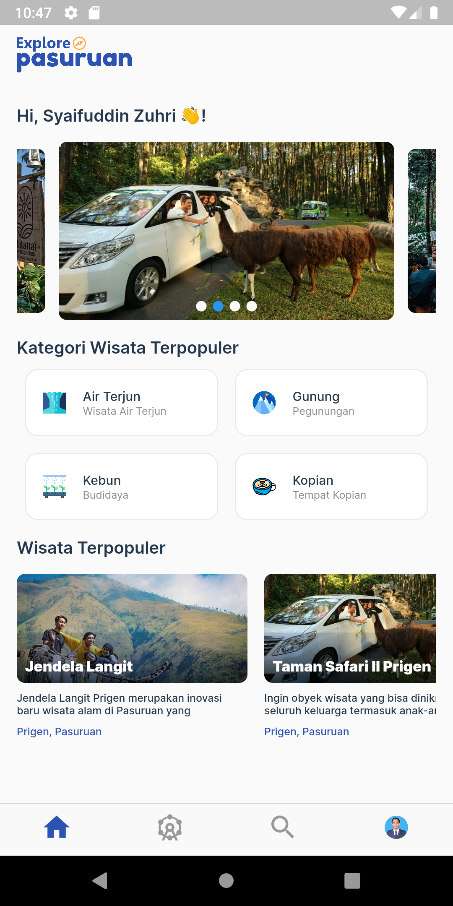
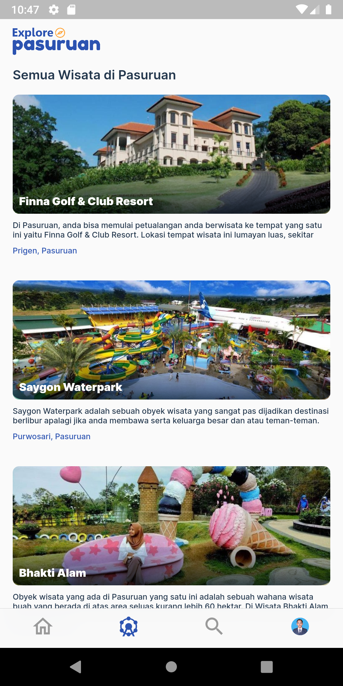
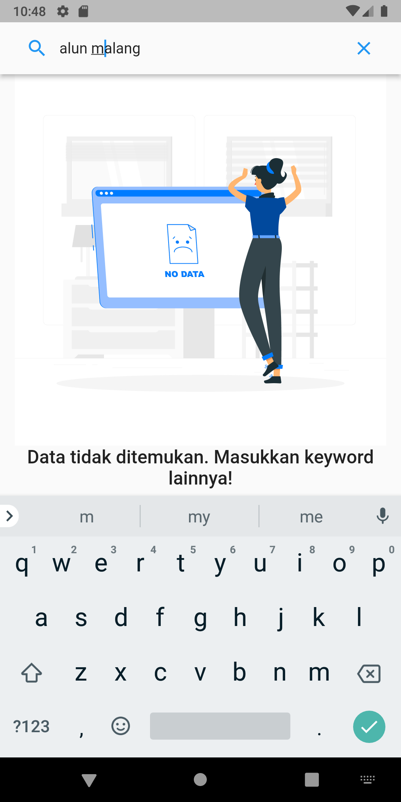

# Mini Project #1

## Nama Aplikasi

## XP (Explore Pasuruan)

## Penjelasan Singkat Aplikasi

Melihat banyaknya objek wisata yang ada di wilayah kabupaten dan kota pasuruan. Maka perlu sebuah platform yang menyediakan suatu informasi yang yang dapat memudahkan mencari destinasi wisata yang ada di kabupaten dan kota pasuruan. Aplikasi XP (Explore Pasuruan) adalah aplikasi yang menyediakan data wisata yang ada di kabupaten pasuruan dan kota pasuruan. Aplikasi wisata ini akan membantu masyrakat untuk menemukan destinasi wisata yang ada di pasuruan.

Didalam aplikasi XP ini terdapat beberapa fitur sementara yang disediakan, diantaranya:

Menampilkan objek-objek wisata yang ada di kabupaten dan kota pasuruan, 
Menampilkan deskripsi dari masing-masing wisata seprti harga tiket, alamat, jam buka, fasilitas dan lain sebagainya.
Fitur pencarian untuk memudahkan mencari objek wisata tertentu berdasarkan keyword yang dimasukkan
Seiring berjalannya waktu dengan dikembangkan aplikasi ini tentunya akan ada penambahan fitur-fitur yang dapat memberikan kompleksitas aplikasi ini. seperti fitur login, register, booking wisata dan lain sebagainya. Selain itu juga bisa ditambahkan dengan informasi lainnya seperti informasi hotel atau penginapan, restoran, kuliner dan lain-lain. Sehingga dapat memberikan kompleksitas yang tinggi dengan dibuatnya aplikasi ini.

## Hasil Screenshoot Aplikasi

> Halaman Home

> Halaman List Wisata

> Halaman Pencarian Wisata

> Halaman 404 (Data tidak ditemukan)

> Halaman Pencarian Profile

## Link Video Presentasi dan Demo 

### https://youtu.be/VrrGRClxXkw